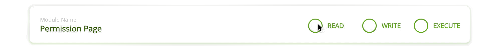
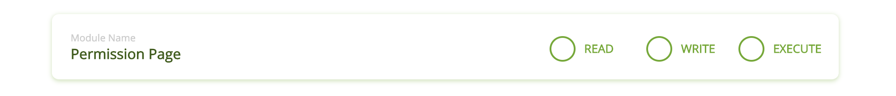

[](https://github.com/WrathChaos/web-component-chmod-checkbox)


[](https://www.npmjs.com/package/chmod-checkbox)
[](https://www.npmjs.com/package/chmod-checkbox)

[](https://opensource.org/licenses/MIT)
[](https://github.com/prettier/prettier)
![Built With Stencil](https://img.shields.io/badge/-Built%20With%20Stencil-16161d.svg?logo=data%3Aimage%2Fsvg%2Bxml%3Bbase64%2CPD94bWwgdmVyc2lvbj0iMS4wIiBlbmNvZGluZz0idXRmLTgiPz4KPCEtLSBHZW5lcmF0b3I6IEFkb2JlIElsbHVzdHJhdG9yIDE5LjIuMSwgU1ZHIEV4cG9ydCBQbHVnLUluIC4gU1ZHIFZlcnNpb246IDYuMDAgQnVpbGQgMCkgIC0tPgo8c3ZnIHZlcnNpb249IjEuMSIgaWQ9IkxheWVyXzEiIHhtbG5zPSJodHRwOi8vd3d3LnczLm9yZy8yMDAwL3N2ZyIgeG1sbnM6eGxpbms9Imh0dHA6Ly93d3cudzMub3JnLzE5OTkveGxpbmsiIHg9IjBweCIgeT0iMHB4IgoJIHZpZXdCb3g9IjAgMCA1MTIgNTEyIiBzdHlsZT0iZW5hYmxlLWJhY2tncm91bmQ6bmV3IDAgMCA1MTIgNTEyOyIgeG1sOnNwYWNlPSJwcmVzZXJ2ZSI%2BCjxzdHlsZSB0eXBlPSJ0ZXh0L2NzcyI%2BCgkuc3Qwe2ZpbGw6I0ZGRkZGRjt9Cjwvc3R5bGU%2BCjxwYXRoIGNsYXNzPSJzdDAiIGQ9Ik00MjQuNywzNzMuOWMwLDM3LjYtNTUuMSw2OC42LTkyLjcsNjguNkgxODAuNGMtMzcuOSwwLTkyLjctMzAuNy05Mi43LTY4LjZ2LTMuNmgzMzYuOVYzNzMuOXoiLz4KPHBhdGggY2xhc3M9InN0MCIgZD0iTTQyNC43LDI5Mi4xSDE4MC40Yy0zNy42LDAtOTIuNy0zMS05Mi43LTY4LjZ2LTMuNkgzMzJjMzcuNiwwLDkyLjcsMzEsOTIuNyw2OC42VjI5Mi4xeiIvPgo8cGF0aCBjbGFzcz0ic3QwIiBkPSJNNDI0LjcsMTQxLjdIODcuN3YtMy42YzAtMzcuNiw1NC44LTY4LjYsOTIuNy02OC42SDMzMmMzNy45LDAsOTIuNywzMC43LDkyLjcsNjguNlYxNDEuN3oiLz4KPC9zdmc%2BCg%3D%3D&colorA=16161d&style=for-the-badge)


<p align="center">
  
  
</p>


Chmod Checkbox comes with three (3) animated checkbox which includes READ, WRITE and EXECUTE values. These text values are customizable. It has built-in chmod calculator for each value. 


## Fundamental CHMOD Architecture


| Value | R   | W   | X   | Description   |
| ----- | --- | --- | --- | ------------- |
| 0     | 0   | 0   | 0   | NO_PERMISSION |
| 1     | 1   | 0   | 0   | READ          |
| 2     | 0   | 1   | 0   | WRITE         |
| 3     | 1   | 1   | 0   | READ/WRITE    |
| 4     | 0   | 0   | 1   | EXECUTE       |
| 5     | 1   | 0   | 1   | READ/EXECUTE  |
| 6     | 0   | 1   | 1   | WRITE/EXECUTE |
| 7     | 1   | 1   | 1   | ALL           |


## Installation

### Script tag (Recommended: Painless)
- Put a script tag similar to this `<script src="https://unpkg.com/chmod-checkbox@latest/dist/chmod-checkbox.js"></script>` in the head of your index.html
- Then you can use the element anywhere in your template, JSX, html etc

### Node Modules
- Run `npm install chmod-checkbox --save`
- Put a script tag similar to this `<script src='node_modules/chmod-checkbox/dist/chmod-checkbox.js'></script>` in the head of your index.html
- Then you can use the element anywhere in your template, JSX, html etc

### In a stencil-starter app
- Run `npm install chmod-checkbox --save`
- Add an import to the npm packages `import chmod-checkbox;`
- Then you can use the element anywhere in your template, JSX, html etc

# Usage

```html
<chmod-checkbox permission="0" />
```


### Configuration - Props


| Property   |  Type  | Default | Description                       |
| ---------- | :----: | :-----: | --------------------------------- |
| permission | number |    0    | get the changing permission value |


### Future Plans

- [x] ~~LICENSE~~
- [ ] Customizable colors
- [ ] Write an article about the lib on Medium


## Author

FreakyCoder, kurayogun@gmail.com

## License

WebComponent Chmod Checkbox is available under the MIT license. See the LICENSE file for more info.

